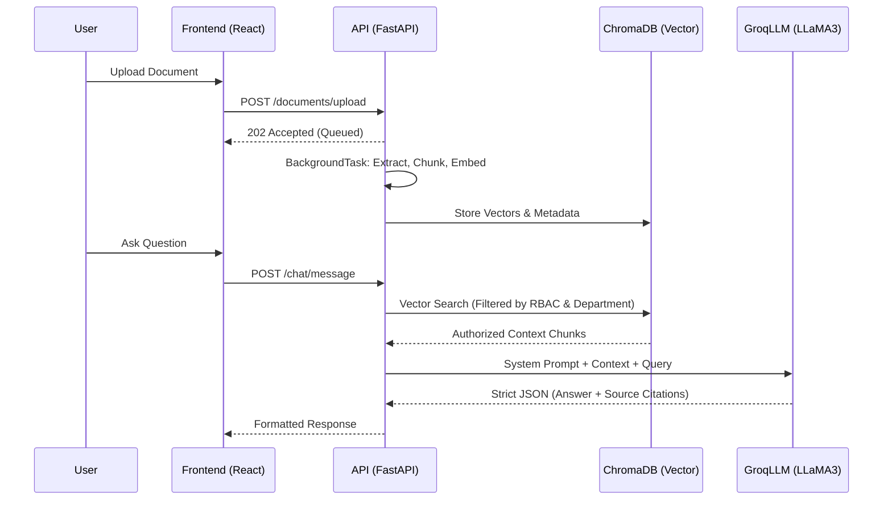

<div align="center">
  
# 🏢 DocuChat Enterprise

An enterprise-grade Knowledge Intelligence Platform engineered for highly secure, role-based, hallucination-free document querying using **Retrieval-Augmented Generation (RAG)**.

[](https://fastapi.tiangolo.com/)
[](https://reactjs.org/)
[](https://www.postgresql.org/)
[](https://www.trychroma.com/)
[](https://groq.com/)

</div>

---

## ✨ Key Features

- **🛡️ Enterprise RBAC:** Granular multi-tier permissions model featuring Admin, Manager, and Employee roles, combined with Departmental boundaries.
- **👁️ Document Visibility Tiers:** Strict access control preventing data leakage. Support for `PRIVATE`, `DEPARTMENT`, `ORGANIZATION`, and `RESTRICTED` documents.
- **🧠 Zero-Latency AI Pipeline:** Documents are chunked and embedded via native `FastAPI BackgroundTasks` (no external message brokers like Celery needed), ensuring real-time vector synchronization with ChromaDB.
- **🤖 High-Speed RAG:** Utilizes Groq's blazing-fast inference engine with LLaMA 3 to generate highly accurate, hallucination-free answers mapped directly to your internal documents.
- **🔗 Intelligent Citations:** AI responses include interactive source citations, allowing users to trace exactly which file and paragraph the AI used for its answer.
- **🔄 Document Versioning:** Automatic deduplication and version control. Uploading a newer version of a document seamlessly purges the outdated AI context, preventing AI context bloat.
- **🔐 Secure Auth:** OTP-based user registration and JWT-based session management, securely isolated per browser tab (`sessionStorage`).

---

## 🏗 System Architecture

The platform follows a modern, decoupled architecture. The frontend is a lightweight SPA that communicates securely with the API Gateway. The API handles relational data (PostgreSQL), while simultaneously delegating heavy vector embeddings to an embedded AI engine (ChromaDB).

### Data Flow Pipeline


---

## 🛠 Technology Stack

### Backend
- **Framework:** FastAPI (Python 3.11+)
- **Relational DB:** PostgreSQL (via SQLAlchemy / Psycopg2)
- **Vector DB:** ChromaDB (Embedded)
- **LLM Provider:** Groq (LLaMA 3)
- **Embeddings:** Sentence-Transformers (`all-MiniLM-L6-v2`)
- **Authentication:** JWT (JSON Web Tokens) with Passlib

### Frontend
- **Framework:** React 18 + Vite
- **Styling:** Tailwind CSS + UI components (Lucide React)
- **State Management:** Zustand (Session Storage persist)
- **Routing:** React Router DOM
- **Network:** Axios

---

## 🚀 Quick Start Guide

### 1. Prerequisites
- Python 3.11+
- Node.js 20+
- PostgreSQL 15+
- [Groq API Key](https://console.groq.com/)

### 2. Backend Setup
```bash
# 1. Navigate to the backend directory
cd backend

# 2. Create and activate a virtual environment
python -m venv venv
# On Windows:
.\venv\Scripts\activate
# On Unix:
# source venv/bin/activate

# 3. Install dependencies
pip install -r requirements.txt

# 4. Configure Environment
# Copy `.env.example` to `.env` and fill in your PostgreSQL credentials, SMTP details (for OTP), and GROQ_API_KEY.

# 5. Start the API Server
uvicorn app.main:app --reload
```
*The backend API will run on `http://localhost:8000`.*

### 3. Frontend Setup
```bash
# 1. Navigate to the frontend directory
cd frontend

# 2. Install dependencies
npm install

# 3. Start the development server
npm run dev
```
*The frontend application will run on `http://localhost:5173`.*

---

## 📚 API Documentation

Once the backend is running, the interactive Swagger / OpenAPI documentation is automatically generated and available at:
👉 **[http://localhost:8000/docs](http://localhost:8000/docs)**

---

## 🛡️ Security & Access Control

DocuChat Enterprise enforces security at the **Vector Database Level**. 
When a user asks a question, the vector similarity search is intercepted by a strict `where` clause filter. The LLM is physically incapable of seeing documents if the user does not possess the correct Role, Department, or Visibility clearance.

- **PRIVATE:** Visible only to the document owner.
- **DEPARTMENT:** Visible to any verified user within the same `department_id`.
- **ORGANIZATION:** General company knowledge; visible to all verified employees.
- **RESTRICTED:** Highly sensitive documents (e.g., payroll, executive briefings). Visible exclusively to the owner and Admins/Managers operating within the *exact same department*.

---

## 🤝 Contributing

Contributions, issues, and feature requests are welcome! 
Please check the [issues page](https://github.com/Anandpbhairamatti/DocuChatEnterprise/issues) for any planned upgrades or bug reports.
